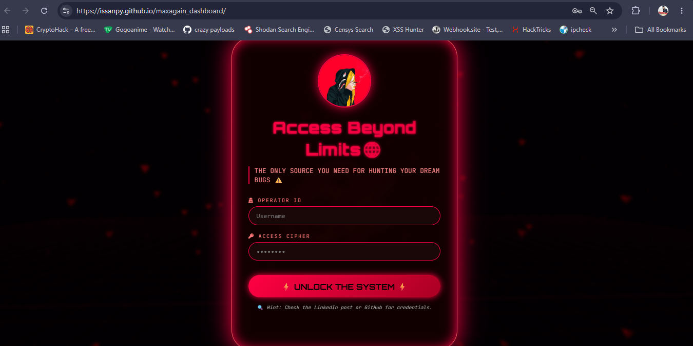
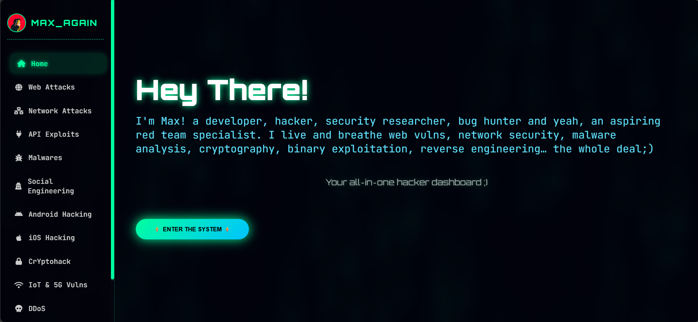
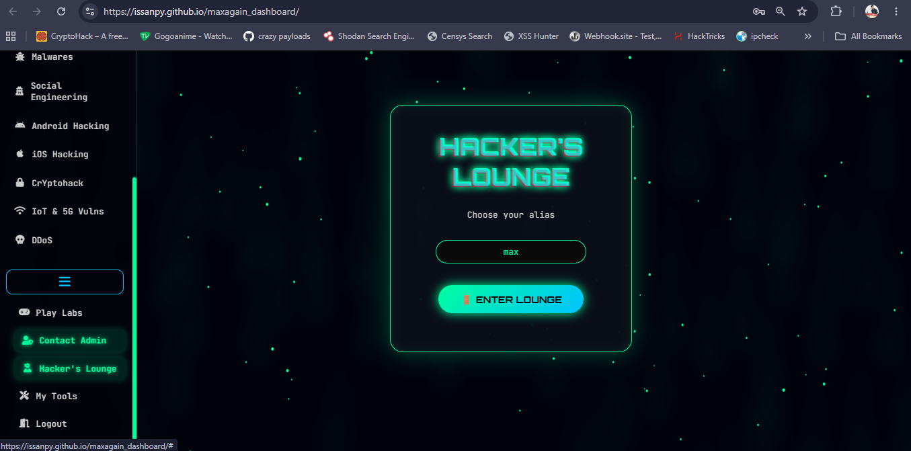

# ⚡ MAXAGAIN

  <b>Everything you need as a hacker.</b>
    
  A Cybersecurity Learning & Research Dashboard built for students, bug bounty hunters, security researchers, and future red teamers.

---

## 🌍 Live Website

🔗 https://issanpy.github.io/maxagain_dashboard/
OPERATOR ID: issan 
ACCESS CIPHER: max

---

# 🔐 Login Portal

The gateway into MAXAGAIN.

Designed with a hacker-themed authentication experience before entering the dashboard.

---

# ⚡ Dashboard

The central command center.

Access multiple cybersecurity domains from a single interface instead of jumping between dozens of tabs, notes, labs, and resources.

### Included Modules

* 🕸️ Web Security
* 🔌 API Security
* 📱 Android Security
* 🍎 iOS Security
* 📡 Wireless Security
* 🦠 Malware Analysis
* 🌐 IoT & 5G Security
* 🎭 Social Engineering
* 🔐 Cryptography
* 💥 DDoS Research
* 🧪 Play Labs
* 🛠️ My Tools
* 👨‍💻 Hacker Lounge

---

# 👨‍💻 Hacker Lounge

A dedicated anonymous discussion area built into MAXAGAIN.

Designed to give the platform a hacker-community feeling while maintaining the cyberpunk theme.

---

# 🎯 Why MAXAGAIN?

Most cybersecurity learners face the same problem:

* Hundreds of bookmarks
* Dozens of browser tabs
* Random PDFs
* Scattered notes
* Different platforms for different topics

MAXAGAIN was built to centralize cybersecurity learning and research into a single dashboard.

One platform.

One workflow.

One place to learn.

---

# 🛠️ Tech Stack

* HTML5
* CSS3
* JavaScript
* GitHub Pages

---

# 🚀 Roadmap

* [ ] Advanced Search
* [ ] User Profiles
* [ ] Progress Tracking
* [ ] Additional Security Modules
* [ ] Interactive Learning Labs
* [ ] Community Features

---

# 👨‍💻 Author

### Issan Panda

Cybersecurity Student • Security Research Enthusiast

Building tools, dashboards, and resources for the cybersecurity community.

⭐ If you like the project, consider starring the repository.
